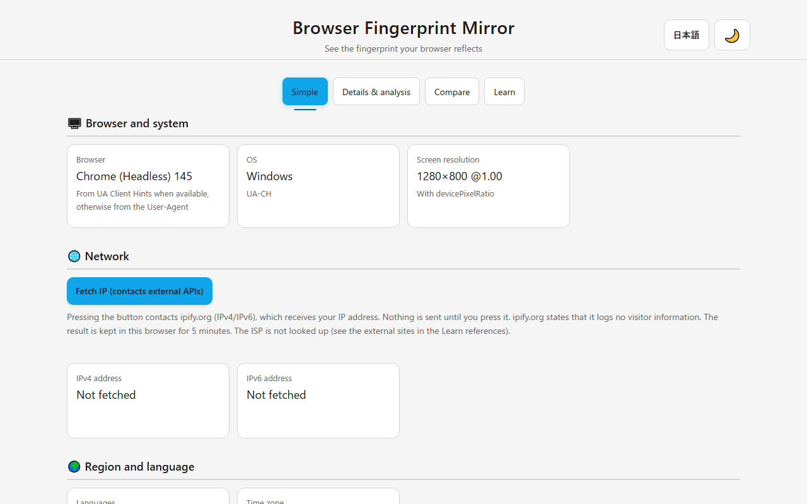
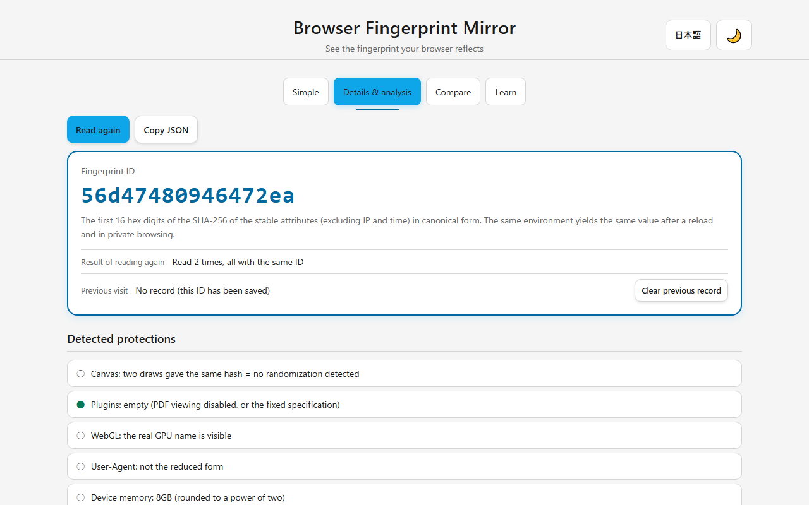
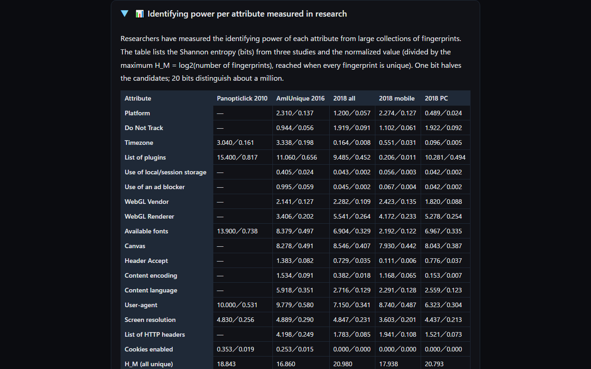
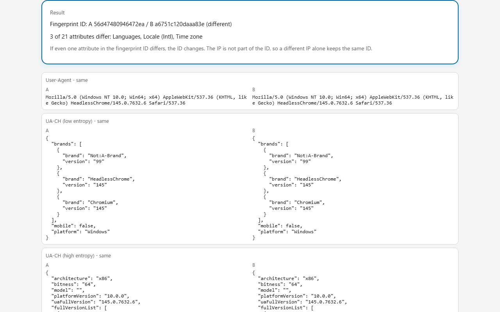

English · [日本語](README.md)

# Browser Fingerprint Mirror - See what your browser reveals


[](https://ipusiron.github.io/browser-fingerprint-mirror/)

**Day077 - 100 Security Tools with Generative AI**

A browser exposes a lot of environment information without you doing anything.

**Browser Fingerprint Mirror** reflects that information like a mirror and shows which values can serve as a fingerprint, how stable that fingerprint is, and whether your browser's protections are working.
Collected values are only displayed on the page; nothing is sent to a server.

- Experience that the fingerprint ID (SHA-256 of the stable attributes) stays the same after a reload and in private browsing
- Check on the spot whether protections such as Canvas randomization or WebGL masking are in effect
- Learn which attributes matter, with the identifying power (bits) measured in published research next to each one

---

## 🌐 Demo

👉 **[https://ipusiron.github.io/browser-fingerprint-mirror/](https://ipusiron.github.io/browser-fingerprint-mirror/)**

Try it directly in your browser. Use `?lang=en` or the language button for English.

---

## 📸 Screenshots

>
>*Simple mode. Browser, OS, resolution, languages, time zone, hardware and privacy settings. The IP is not fetched until you press "Fetch IP"*

>
>*Details & analysis mode. Fingerprint ID, the result of "Read again", comparison with the previous visit, detected protections and the attribute list with identifying power from research*

>
>*Learn mode (dark theme). The table of identifying power per attribute from the 2010, 2016 and 2018 studies, with notes on how to read it*

>
>*Compare mode. Put the current environment into A and the "Copy JSON" of another environment into B to see whether the fingerprint IDs match and which attributes differ*

---

## 🔍 What is browser fingerprinting?

Browser fingerprinting combines the environment information a browser exposes (User-Agent, screen resolution, languages, time zone, hardware, quirks of Canvas/WebGL/Audio rendering and processing) to identify the "same browser environment" without cookies.

- Each value may be common, yet the combination can be identifying
- Unlike cookies, users cannot delete it, and private browsing does not change device or OS information
- A fingerprint alone does not reveal an address or a real name. The problem is being tracked as "the person with the same environment"

This tool is a mirror for checking the mechanism in your own environment.
It has no population (other people's fingerprints), so it cannot tell "one in how many" you are.
Instead, without sending anything, it shows what is visible, whether it is stable, and whether protections are in effect.

---

## ✨ Features

### Simple mode

- Browser and OS (UA Client Hints first, otherwise the User-Agent), screen resolution and devicePixelRatio
- Languages, time zone, touch/CPU cores/memory, and the state of cookies, Do Not Track and Global Privacy Control
- IPv4/IPv6 addresses are fetched from an external API (ipify.org) only when you press "Fetch IP". The result is kept in the browser for 5 minutes. The ISP is not looked up (see the external sites in the references)

### Details & analysis mode

- Fingerprint ID = the first 16 hex digits of the SHA-256 of the stable attributes (excluding IP and time) in canonical form
- "Read again" recomputes and shows whether the ID stays the same (and which attributes changed)
- The previous visit's fingerprint ID is stored in the browser and compared on the next visit ("same" or "different"), a hands-on demonstration of cookie-less tracking. "Clear previous record" removes it
- Detected protections = Canvas randomization (two draws with different hashes), plugin list fixed by specification, WebGL name masked, reduced User-Agent, device memory hidden, DNT/GPC, and whether the time zone is UTC
- Attribute list = the values of 21 items with their stability class, whether they are in the fingerprint ID, and the identifying power (bits) measured in research
- Copy JSON (copies the displayed data as is; failures are reported where the clipboard is unavailable)

### Compare mode

- Put the current environment, or the "Copy JSON" output of another environment (pasted or loaded from a JSON file), into A and B and compare the 21 items attribute by attribute
- Shows whether the fingerprint IDs match, how many attributes differ and which, and whether only attributes outside the fingerprint ID differ
- The same screen lists experiments: private browsing, another browser, a VPN, extensions, another device
- Imported JSON is limited to 256KB, validated for shape and types, and strings are truncated before display (nothing is sent anywhere)

### Learn mode

- What browser fingerprinting is, fingerprint ID and stability, identifying power measured in research, current browsers and countermeasures, limits, references

### Other

- Dark/light theme. Follows the OS setting unless a choice has been saved
- Japanese and English interface (`?lang=ja|en`, the language button, or the browser language)
- Fully keyboard operable (tabs with arrow keys, Home and End). Text/background contrast of at least 4.5:1
- No horizontal scrolling at phone widths (320px)

---

## 📖 How to use

1. Open the demo page. Fingerprint collection and the fingerprint ID computation happen on load (nothing is sent)
2. Look at the basic environment on the "Simple" tab. Press "Fetch IP" only when you need the IP address
3. Check the fingerprint ID on the "Details & analysis" tab and press "Read again" to see whether it stays the same
4. Open the same page in private browsing or in another browser and compare the fingerprint ID
5. Check "Detected protections" to see whether your browser's defenses (Brave randomization, Firefox `privacy.resistFingerprinting`, etc.) are in effect
6. Read the attribute list to see which attributes enter the fingerprint ID and how much they mattered in research
7. Use "Copy JSON" to copy all data, then paste it (or load the JSON file) into B on the "Compare" tab and compare it with the current environment

---

## 📐 Layout

| Area | Content |
|---|---|
| Header | Title, language and theme toggles |
| Tabs | Simple / Details & analysis / Compare / Learn |
| Simple | Cards for browser and system, network (with the fetch button), region and language, hardware, privacy settings |
| Details & analysis | Actions (Read again, Copy JSON), fingerprint ID card (stability, previous visit), detected protections, attribute list, privacy/disclaimer |
| Compare | Inputs for A and B (current environment, paste, file), compare and swap, result (fingerprint IDs, differing attributes), A/B per attribute, experiments to try |
| Learn | Explanations in accordions |

---

## 🔬 Technical notes

### How the fingerprint ID is made

1. `js/fp-collect.js` reads values from browser APIs (the 21 items in the catalog below)
2. The items marked "in the fingerprint ID" are turned into canonical JSON with keys in dictionary order
3. SHA-256 of that JSON (implemented in pure JavaScript and checked against Node's `crypto` in tests) gives the fingerprint ID as its first 16 hex digits

The IP address (changes per connection) and the time are excluded.
Canvas is drawn twice; only the first hash enters the ID (the second is for detecting randomization).

### Attribute catalog

| Attribute | Stability | Fingerprint ID | Bits PC | Bits mobile | Attribute in the study |
|---|---|---|---|---|---|
| User-Agent | Changes with updates | included | 6.323 | 8.740 | User-agent |
| UA-CH (low entropy) | Changes with updates | included | — | — | — |
| UA-CH (high entropy) | Changes with updates | included | — | — | — |
| navigator.platform | Set by device and OS (hard to change) | included | 0.489 | 2.274 | Platform |
| Screen | Set by device and OS (hard to change) | included | 4.437 | 3.603 | Screen resolution |
| Languages | Set by settings (changeable) | included | 2.559 | 2.291 | Content language |
| Locale (Intl) | Set by settings (changeable) | included | — | — | — |
| Time zone | Set by settings (changeable) | included | 0.096 | 0.551 | Timezone |
| Storage availability | Set by settings (changeable) | included | 0.042 | 0.056 | Use of local/session storage |
| Cookies | Set by settings (changeable) | included | 0.000 | 0.000 | Cookies enabled |
| Do Not Track | Set by settings (changeable) | included | 1.922 | 1.102 | Do Not Track |
| Global Privacy Control | Set by settings (changeable) | included | — | — | — |
| Hardware | Set by device and OS (hard to change) | included | — | — | — |
| Media queries | Set by settings (changeable) | included | — | — | — |
| WebGL vendor | Set by device and OS (hard to change) | included | 1.820 | 2.423 | WebGL Vendor |
| WebGL renderer | Set by device and OS (hard to change) | included | 5.278 | 4.172 | WebGL Renderer |
| Canvas hash | Set by device and OS (hard to change) | included | 8.043 | 7.930 | Canvas |
| Audio hash | Set by device and OS (hard to change) | included | — | — | — |
| Plugins | Fixed by specification (no identifying power) | included | 10.281 | 0.206 | List of plugins |
| Fonts (detected by width measurement) | Set by device and OS (hard to change) | included | 6.967 | 2.192 | Available fonts |
| Network (IP) | Changes per connection | excluded | — | — | — |

"Bits" is the Shannon entropy that Gómez-Boix, Laperdrix and Baudry (2018) measured on 2,067,942 fingerprints collected on a major French website.
The PC column (1,816,776 fingerprints) or the mobile column (251,166) is chosen from the UA-CH `mobile` hint and similar signals.
"—" marks attributes the study did not measure.

### Font detection

For each candidate font name (Windows, macOS, Linux, Japanese, monospace, symbol fonts), the width and height of a test string are measured with the font falling back to each of three generic families (monospace, sans-serif, serif). If any of the three differs from the generic family alone, the font is considered installed.
Three baselines are needed because some fonts, such as Meiryo, have the same width as one generic family (a single baseline would miss them).
`document.fonts.check()` is not used because it returns true even for names that are not installed.
Fonts outside the candidate list cannot be detected, so the result is bounded by the size of the list.

### Identifying power per attribute measured in research

The table from three studies (bits / normalized entropy). Normalized entropy divides by the maximum H_M = log2(number of fingerprints), reached when every fingerprint is unique.

| Attribute | Panopticlick 2010 | AmIUnique 2016 | 2018 all | 2018 mobile | 2018 PC |
|---|---|---|---|---|---|
| Platform | — | 2.310／0.137 | 1.200／0.057 | 2.274／0.127 | 0.489／0.024 |
| Do Not Track | — | 0.944／0.056 | 1.919／0.091 | 1.102／0.061 | 1.922／0.092 |
| Timezone | 3.040／0.161 | 3.338／0.198 | 0.164／0.008 | 0.551／0.031 | 0.096／0.005 |
| List of plugins | 15.400／0.817 | 11.060／0.656 | 9.485／0.452 | 0.206／0.011 | 10.281／0.494 |
| Use of local/session storage | — | 0.405／0.024 | 0.043／0.002 | 0.056／0.003 | 0.042／0.002 |
| Use of an ad blocker | — | 0.995／0.059 | 0.045／0.002 | 0.067／0.004 | 0.042／0.002 |
| WebGL Vendor | — | 2.141／0.127 | 2.282／0.109 | 2.423／0.135 | 1.820／0.088 |
| WebGL Renderer | — | 3.406／0.202 | 5.541／0.264 | 4.172／0.233 | 5.278／0.254 |
| Available fonts | 13.900／0.738 | 8.379／0.497 | 6.904／0.329 | 2.192／0.122 | 6.967／0.335 |
| Canvas | — | 8.278／0.491 | 8.546／0.407 | 7.930／0.442 | 8.043／0.387 |
| Header Accept | — | 1.383／0.082 | 0.729／0.035 | 0.111／0.006 | 0.776／0.037 |
| Content encoding | — | 1.534／0.091 | 0.382／0.018 | 1.168／0.065 | 0.153／0.007 |
| Content language | — | 5.918／0.351 | 2.716／0.129 | 2.291／0.128 | 2.559／0.123 |
| User-agent | 10.000／0.531 | 9.779／0.580 | 7.150／0.341 | 8.740／0.487 | 6.323／0.304 |
| Screen resolution | 4.830／0.256 | 4.889／0.290 | 4.847／0.231 | 3.603／0.201 | 4.437／0.213 |
| List of HTTP headers | — | 4.198／0.249 | 1.783／0.085 | 1.941／0.108 | 1.521／0.073 |
| Cookies enabled | 0.353／0.019 | 0.253／0.015 | 0.000／0.000 | 0.000／0.000 | 0.000／0.000 |
| H_M (all unique) | 18.843 | 16.860 | 20.980 | 17.938 | 20.793 |
| Number of fingerprints | 470,161 | 118,934 | 2,067,942 | 251,166 | 1,816,776 |
| Share of unique fingerprints | 83.6% | 89.4% | 33.6% | 18.5% | 35.7% |

How to read it.

- Values depend on the population. The 2018 time zone is only 0.164 bit because the visitors came from a French site; collecting only Japanese users would do the same
- Some 2018 values no longer apply to current browsers. The plugin list is fixed by the specification (almost no identifying power) and Chrome reduced the User-Agent
- The share of unique fingerprints dropped from 83.6% to 89.4% to 33.6% because of the audience (privacy-minded visitors versus the general public) rather than technical progress, according to the 2018 paper
- This tool does not add these values up as "your rarity"; they are references per attribute type

### Protection detection rules

| Item | Rule |
|---|---|
| Canvas randomization | "Active" if the same picture drawn twice gives different hashes (Brave farbling, Firefox `privacy.resistFingerprinting`) |
| Plugins | "Fixed list (no identifying power)" if the list is empty or contains only the 5 entries fixed by the specification (PDF Viewer, Chrome PDF Viewer, Chromium PDF Viewer, Microsoft Edge PDF Viewer, WebKit built-in PDF) |
| WebGL | "Masked" if vendor and renderer are `Mozilla` (resistFingerprinting), if the renderer is `Apple GPU` (Safari), or if WebGL is unavailable |
| User-Agent | "Reduced form" if a Chromium User-Agent has a `.0.0.0` version |
| Device memory | "Not exposed" if `navigator.deviceMemory` is absent (Firefox and Safari do not implement it; Chromium rounds to a power of two) |
| DNT / GPC | The values of `navigator.doNotTrack` and `navigator.globalPrivacyControl` ("not supported" where GPC is absent) |
| Time zone | "UTC (possibly resistFingerprinting)" if the offset is 0 and the zone name is UTC-like (`UTC`, `Atlantic/Reykjavik`, etc.) |

Only observed facts are listed.
Anything missing was "not detected", which does not mean "no protection".

### Comparison and JSON import

The "Compare" tab compares the 21 catalog items of two snapshots as canonical JSON and reports which attributes differ and whether any attribute inside the fingerprint ID differs.
Pasted or loaded JSON is not trusted: it must be at most 256KB, an object, and in this tool's shape (`ua` plus at least three catalog items); strings are cut to 2,000 characters, arrays to 200 items and depth to 5, and control characters are removed before display.
Rendering uses `textContent`, so nothing in the JSON can become script.

### OS and browser detection

If UA Client Hints (`navigator.userAgentData`) are available, their `platform` and `brands` take precedence (GREASE fake brands are ignored).
Otherwise the User-Agent string is checked in the order iPhone/iPad → CrOS → Android → Windows → Macintosh → Linux.
An iPad in desktop mode calls itself Macintosh, so `maxTouchPoints` of 2 or more means iPadOS.

---

## 🎯 Use cases

- Education (IT and security classes): students see that the fingerprint ID does not change in private browsing and experience how tracking works without cookies. The same screen shows that a VPN changes only the IP
- Education (information theory): use the "bits" in the attribute list to explain entropy as "the number of times the candidates are halved" with values from the students' own environment. The drop from 2010 to 2018 (a different population) makes a good discussion topic
- Work (web and legal teams): check what can actually be read from a browser before writing the "information we collect" section of a privacy policy. The tool's own privacy/disclaimer text is a reference
- Work (support and QA): ask users to send the "Copy JSON" output to learn their exact OS, browser, resolution and languages (the JSON contains no IP unless it was fetched)
- Home: look together at what a family member's device exposes. Compare the fingerprint ID and detected protections before and after installing an extension such as Canvas Blocker or enabling a browser protection
- Hobby and writing: verify UA-CH, Canvas fingerprints and WebGL renderer strings that appear in CTF web challenges or articles. Fill the "test environment" section of a blog post from the JSON
- Research: map the study tables (2010, 2016, 2018) to your own values and consider which attributes still matter and which have been neutralized by specifications. Put the JSON of several browsers or devices side by side on the "Compare" tab
- Combined with other tools: Browser Permission Radar (Day092) shows permission exposure while this tool shows fingerprint exposure. Use Cover Your Tracks or AmIUnique for population comparison

Limits apply.
The tool has no population, so it cannot report rarity.
Protection detection covers only what can be observed, and the IP depends on external APIs.

---

## 🔒 Security and privacy

- Collected values are only displayed on the page and never sent to a server. The only outbound connection is ipify.org when you press "Fetch IP"; it receives your IP address. ipify.org states that it logs no visitor information
- The browser stores only the theme and language choice, the previous fingerprint ID (removable with "Clear previous record") and the IP information for 5 minutes. Everything read back is validated and discarded if corrupted
- The meta CSP is `default-src 'self'` without `unsafe-inline`; `connect-src` lists only the two ipify hosts; the referrer policy is `no-referrer`
- Rendering uses `textContent`, never `innerHTML`. API responses are validated before display
- No external libraries, CDNs or analytics

---

## ⚠️ Notes

- "Identifying power in research" is an average from research data, not the rarity of your value
- "Detected protections" shows only observed facts. Not detected does not mean no protection
- On a connection without IPv6, the IPv6 field reads "unsupported or failed". The ISP is not looked up (APIs that answer with bot-protection challenges cannot be used from a browser)
- The page works from `file://`, but the clipboard is denied there (the failure is reported)
- This is an educational demo; it does not encourage tracking or commercial use

---

## ❓ FAQ

Q. My fingerprint ID changes every time.
A. Look at "Detected protections" first. In browsers with Canvas randomization (such as Brave), the hash changes on every reload by design. The result of "Read again" lists which attributes changed.

Q. Why is the ID the same in private browsing?
A. The values that enter the fingerprint ID (device, OS, browser version, screen, languages, …) do not change in private browsing. That is exactly the problem with cookie-less tracking.

Q. What does the previous-visit field store?
A. Only the 16-digit fingerprint ID and a timestamp, in this browser's localStorage. Nothing is sent to a server. "Clear previous record" removes it.

Q. Is there a 0 to 100 score?
A. No. A tool without a population cannot turn rarity into a score, so it shows the stability of the fingerprint ID and per-attribute reference values from research instead.

Q. I want to know one in how many people I am.
A. Use a tool that compares with a population (Cover Your Tracks, AmIUnique). They send the fingerprint to a server for comparison.

---

## 🔗 References and related tools

- Browser Permission Radar (Day092): a tool that shows browser permission exposure. [Repository](https://github.com/ipusiron/browser-permission-radar)
- Cover Your Tracks (EFF): population comparison and tracker-blocking tests. [https://coveryourtracks.eff.org/](https://coveryourtracks.eff.org/)
- AmIUnique (INRIA): population comparison and history through an extension. [https://amiunique.org/](https://amiunique.org/)
- BrowserLeaks: deep dives per API. [https://browserleaks.com/](https://browserleaks.com/)
- Eckersley, P. "How Unique Is Your Web Browser?" PETS 2010 (Panopticlick). [PDF](https://coveryourtracks.eff.org/static/browser-uniqueness.pdf)
- Laperdrix, P., Rudametkin, W., Baudry, B. "Beauty and the Beast: Diverting modern web browsers to build unique browser fingerprints." IEEE S&P 2016 (AmIUnique). [HAL](https://hal.science/hal-01285470)
- Gómez-Boix, A., Laperdrix, P., Baudry, B. "Hiding in the Crowd: an Analysis of the Effectiveness of Browser Fingerprinting at Large Scale." WWW 2018. [HAL](https://hal.inria.fr/hal-01718234)
- User-Agent reduction (Privacy Sandbox). [https://privacysandbox.google.com/protections/user-agent](https://privacysandbox.google.com/protections/user-agent)
- MDN: [navigator.plugins](https://developer.mozilla.org/en-US/docs/Web/API/Navigator/plugins), [navigator.deviceMemory](https://developer.mozilla.org/en-US/docs/Web/API/Navigator/deviceMemory), [getHighEntropyValues](https://developer.mozilla.org/en-US/docs/Web/API/NavigatorUAData/getHighEntropyValues), [globalPrivacyControl](https://developer.mozilla.org/en-US/docs/Web/API/Navigator/globalPrivacyControl)
- Brave "Fingerprinting defenses 2.0". [https://brave.com/privacy-updates/4-fingerprinting-defenses-2.0/](https://brave.com/privacy-updates/4-fingerprinting-defenses-2.0/)

---

## 📁 Directory structure

```
browser-fingerprint-mirror/
├── .github/                 # GitHub settings
│   └── workflows/           # GitHub Actions workflows
│       └── test.yml         # Runs npm test on push and pull_request
├── .gitignore               # Git ignore rules
├── .nojekyll                # For GitHub Pages (skip Jekyll)
├── AGENTS.md                # Development guide (Codex CLI)
├── CLAUDE.md                # Development guide (Claude Code)
├── LICENSE                  # MIT License
├── README.en.md             # Project description (this file, English)
├── README.md                # Project description (Japanese)
├── assets/                  # Screenshots
│   ├── en/                  # English screenshots
│   │   ├── screenshot.png   # Simple mode
│   │   ├── screenshot2.png  # Details & analysis mode
│   │   ├── screenshot3.png  # Learn mode (dark)
│   │   └── screenshot4.png  # Compare mode
│   ├── screenshot.png       # Simple mode (Japanese)
│   ├── screenshot2.png      # Details & analysis mode (Japanese)
│   ├── screenshot3.png      # Learn mode, dark (Japanese)
│   └── screenshot4.png      # Compare mode (Japanese)
├── index.html               # Page structure (CSP, tabs, modes)
├── js/                      # Logic, collection, strings, language
│   ├── fp-collect.js        # Reads browser APIs. The IP lookup lives only here
│   ├── fp-core.js           # Pure functions (SHA-256, detection, fingerprint ID, protections, validation, study tables)
│   ├── i18n.js              # Language selection and static text replacement
│   └── messages.js          # UI strings (Japanese and English)
├── package.json             # Defines npm test (node --test). No dependencies
├── script.js                # Page side (DOM building and events)
├── style.css                # Styles (dark/light)
└── test/                    # Automated tests (node:test)
    ├── contrast.test.js     # Text/background contrast and layout rules
    ├── core.test.js         # Logic (SHA-256, detection, fingerprint ID, protections, validation)
    ├── format.test.js       # File hygiene (no minification, no Japanese literals, allowed hosts)
    ├── html.test.js         # Static checks of index.html (CSP, ARIA, ids)
    ├── i18n.test.js         # Dictionary keys, HTML text versus dictionary, language selection
    ├── load.js              # Loads the page scripts into the tests
    └── readme.test.js       # README tables and structure verified from code
```

---

## 🧪 Tests

```bash
npm test
```

- Runs on Node 22 or later with no packages (`node --test`)
- Logic tests (SHA-256 against Node's `crypto` and known vectors, the OS/browser detection matrix, fingerprint ID stability, protections, font detection, snapshot validation and comparison, API and cache validation)
- HTML, color and format tests (CSP, ARIA, text/background contrast, minification detection, no Japanese literals, host restrictions)
- Language tests (shared keys, HTML text equals the dictionary, no Japanese left in English)
- README tests (attribute catalog and study tables recomputed from code, complete directory tree, screenshots exist, notation, both READMEs aligned)
- GitHub Actions runs them on push and pull_request

---

## 💻 Environment

- Verified in Chromium browsers (Chrome, Edge, Brave) and Firefox. Safari and mobile browsers lack UA-CH or `deviceMemory`, so those items read "—" or "not supported"
- Requires JavaScript. Works from `file://` (without the clipboard)
- Screen width of 320px or more

---

## 📄 License

MIT License – see [LICENSE](LICENSE) for details.

---

## 🛠️ About this tool

This tool was developed as part of the "100 Security Tools with Generative AI" project.
In this project, a variety of security-related tools are created and published over 100 days with the help of AI.

For details and the other tools, see the page below.

🔗 [https://akademeia.info/?page_id=42163](https://akademeia.info/?page_id=42163)
