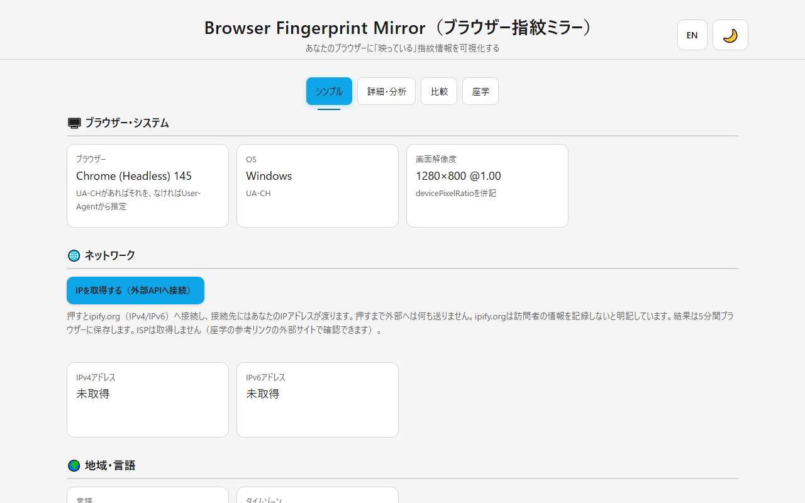
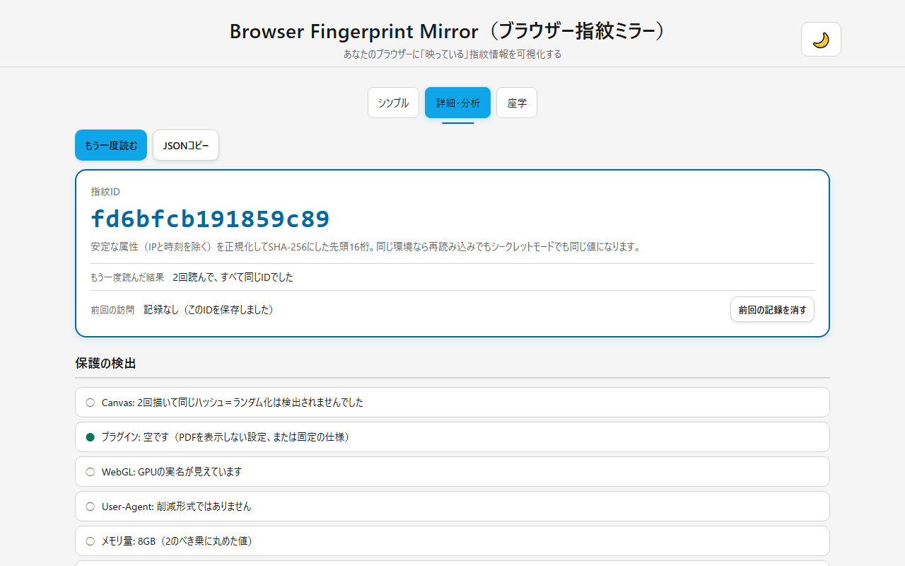
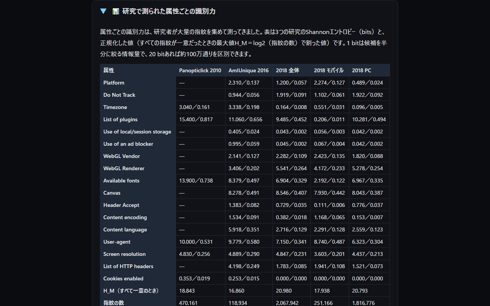

<!--
---
id: day077
slug: browser-fingerprint-mirror

title: "Browser Fingerprint Mirror"

subtitle_ja: "ブラウザー指紋ミラー"
subtitle_en: "See what your browser reveals, and how stable it is"

description_ja: "ブラウザーが公開する環境情報（UA、UA-CH、解像度、言語、タイムゾーン、Canvas/WebGL/Audioのハッシュなど）を映し、指紋IDの安定性と保護の検出、研究で測られた属性ごとの識別力を示す教育用ツール。サーバーへ送らない"
description_en: "An educational tool that mirrors what a browser exposes (UA, UA-CH, screen, language, timezone, Canvas/WebGL/Audio hashes), shows a fingerprint ID with its stability, detects visible protections, and annotates each attribute with the identifying power measured in published research. Nothing is sent to a server"

category_ja:
  - プライバシー
  - Webセキュリティ
  - ブラウザー指紋
category_en:
  - Privacy
  - Web Security
  - Browser Fingerprinting

difficulty: 2

tags:
  - browser
  - fingerprinting
  - privacy
  - security
  - education
  - visualization
  - javascript
  - canvas
  - webgl
  - audio

repo_url: "https://github.com/ipusiron/browser-fingerprint-mirror"
demo_url: "https://ipusiron.github.io/browser-fingerprint-mirror/"

hub: true
---
-->

[English](README.en.md) · 日本語

# Browser Fingerprint Mirror - ブラウザー指紋ミラー


[](https://ipusiron.github.io/browser-fingerprint-mirror/)

**Day077 - 生成AIで作るセキュリティツール100**

ブラウザーは、あなたが何も操作しなくても多くの環境情報を公開しています。

**Browser Fingerprint Mirror（ブラウザー指紋ミラー）**は、それらを鏡のように映して「どの情報が指紋として使われうるか」「その指紋はどれくらい安定か」「あなたのブラウザーの保護は効いているか」を見せる教育用ツールです。
収集した値はページの中で表示するだけで、サーバーへは送りません。

- 指紋ID（安定な属性のSHA-256）が、再読み込みやシークレットモードでも同じになることを体験できる
- Canvasのランダム化やWebGLの伏せ字など、ブラウザーの保護が効いているかをその場で確かめられる
- 属性ごとに、研究で測られた識別力（bits）を添えて「何が効くのか」を学べる

---

## 🌐 デモページ

👉 **[https://ipusiron.github.io/browser-fingerprint-mirror/](https://ipusiron.github.io/browser-fingerprint-mirror/)**

ブラウザーで直接お試しいただけます。

---

## 📸 スクリーンショット

>
>*シンプルモード。ブラウザー・OS・解像度・言語・タイムゾーン・ハードウェア・プライバシー設定を表示する。IPは「IPを取得する」を押すまで取得しない*

>
>*詳細・分析モード。指紋ID、「もう一度読む」の結果、前回の訪問との比較、保護の検出、属性の一覧（研究での識別力つき）*

>
>*座学モード（ダークモード）。2010年・2016年・2018年の研究で測られた属性ごとの識別力の表と、読み方の注意*

---

## 🔍 ブラウザー指紋とは

ブラウザー指紋（Browser Fingerprinting）とは、ブラウザーが公開する環境情報（User-Agent・画面解像度・言語・タイムゾーン・ハードウェア・Canvas/WebGL/Audioの描画や処理の癖など）を組み合わせて、Cookieを使わずに「同じブラウザー環境」を識別する技術です。

- 1つ1つの値はありふれていても、組み合わせると識別できることがある
- Cookieと違って利用者が消せない。シークレットモードでも端末やOSの情報は変わらない
- ただし指紋だけで住所や本名がわかるわけではない。「同じ環境の人」として追跡されるのが問題である

本ツールは、この仕組みを自分の環境で確かめるための鏡です。
母集団（ほかの人の指紋）を持たないので「あなたが何人に1人か」は出せません。
そのかわり、サーバーへ送らずに「何が見えているか」「安定しているか」「保護が効いているか」を見せます。

---

## ✨ 機能

### シンプルモード

- ブラウザーとOS（UA Client Hintsを優先し、なければUser-Agentから推定）。画面解像度とdevicePixelRatio
- 言語、タイムゾーン、タッチ・CPUコア数・メモリ量、Cookie・Do Not Track・Global Privacy Controlの状態
- IPv4/IPv6アドレスは「IPを取得する」を押したときだけ外部API（ipify.org）へ接続して取得する。結果は5分間ブラウザーに保存する。ISPは取得しない（参考リンクの外部サイトで確認できる）

### 詳細・分析モード

- 指紋ID＝安定な属性（IPと時刻を除く）を正規化してSHA-256にした先頭16桁
- 「もう一度読む」で再計算し、同じIDになるか（値が変わった属性はどれか）を表示する
- 前回の訪問の指紋IDをブラウザーに保存し、再訪時に「同じ／違う」を表示する（Cookieを使わない追跡の体験。「前回の記録を消す」で消せる）
- 保護の検出＝Canvasのランダム化（2回描いてハッシュが違うか）・プラグイン一覧の固定・WebGLの実名の伏せ字・User-Agentの削減形式・メモリ量の非公開・DNT/GPC・タイムゾーンがUTCかどうか
- 属性の一覧＝20項目の値と、安定性の分類、指紋IDに含むか、研究で測られた識別力（bits）
- JSONコピー（表示中のデータをそのままコピー。コピーできない環境では失敗を知らせる）

### 座学モード

- ブラウザー指紋とは、指紋IDと安定性、研究で測られた識別力、ブラウザーの現状と対策、限界、参考リンク

### その他

- ダーク／ライトのテーマ。保存した選択がなければOSの設定に従う
- 日本語と英語の画面（`?lang=ja|en`、言語ボタン、またはブラウザーの言語）
- キーボードだけで操作できる（タブは矢印キー・Home・End）。文字と背景のコントラストは4.5:1以上
- スマートフォン幅（320px）でも横スクロールしない

---

## 📖 使い方

1. デモページを開く。読み込み時に指紋の収集と指紋IDの計算が行われる（外部へは何も送らない）
2. 「シンプル」タブで基本的な環境情報を見る。IPアドレスが必要なときだけ「IPを取得する」を押す
3. 「詳細・分析」タブで指紋IDを確認し、「もう一度読む」を押して同じIDになるかを確かめる
4. シークレットモードや別のブラウザーで同じページを開き、指紋IDが変わるかを比べる
5. 「保護の検出」で、ブラウザーの保護機能（Braveのランダム化やFirefoxの`privacy.resistFingerprinting`など）が効いているかを見る
6. 「属性の一覧」で、どの属性が指紋IDに入り、研究ではどれくらい識別に効いたかを読む
7. 「JSONコピー」で全データをコピーし、別の環境の結果と比べる

---

## 📐 画面構成

| 領域 | 内容 |
|---|---|
| ヘッダー | タイトル、言語切替、テーマ切替 |
| タブ | シンプル／詳細・分析／座学 |
| シンプル | ブラウザー・システム、ネットワーク（取得ボタンつき）、地域・言語、ハードウェア、プライバシー設定のカード |
| 詳細・分析 | 操作（もう一度読む・JSONコピー）、指紋IDのカード（安定性・前回の訪問）、保護の検出、属性の一覧、プライバシー／免責 |
| 座学 | アコーディオン形式の解説 |

---

## 🔬 技術的な説明

### 指紋IDの作り方

1. `js/fp-collect.js`がブラウザーのAPIから値を集める（下の目録の20項目）
2. そのうち「指紋IDに含む」項目だけを取り出し、キーを辞書順に並べた正規化JSONにする
3. 正規化JSONのSHA-256（純JavaScriptで実装。テストでNodeの`crypto`と照合）を取り、先頭16桁を指紋IDとして表示する

IPアドレス（接続ごとに変わる）と時刻は含めません。
Canvasは2回描いて、1回目のハッシュだけをIDに使います（2回目はランダム化の検出用）。

### 属性の目録

| 属性 | 安定性 | 指紋ID | 識別力 PC | 識別力 モバイル | 研究の属性名 |
|---|---|---|---|---|---|
| User-Agent | 更新で変わる | 含む | 6.323 | 8.740 | User-agent |
| UA-CH（低エントロピー） | 更新で変わる | 含む | — | — | — |
| UA-CH（高エントロピー） | 更新で変わる | 含む | — | — | — |
| navigator.platform | 端末・OSで決まる（変えにくい） | 含む | 0.489 | 2.274 | Platform |
| 画面 | 端末・OSで決まる（変えにくい） | 含む | 4.437 | 3.603 | Screen resolution |
| 言語 | 設定で決まる（変えられる） | 含む | 2.559 | 2.291 | Content language |
| ロケール（Intl） | 設定で決まる（変えられる） | 含む | — | — | — |
| タイムゾーン | 設定で決まる（変えられる） | 含む | 0.096 | 0.551 | Timezone |
| ストレージの可否 | 設定で決まる（変えられる） | 含む | 0.042 | 0.056 | Use of local/session storage |
| Cookie | 設定で決まる（変えられる） | 含む | 0.000 | 0.000 | Cookies enabled |
| Do Not Track | 設定で決まる（変えられる） | 含む | 1.922 | 1.102 | Do Not Track |
| Global Privacy Control | 設定で決まる（変えられる） | 含む | — | — | — |
| ハードウェア | 端末・OSで決まる（変えにくい） | 含む | — | — | — |
| メディアクエリ | 設定で決まる（変えられる） | 含む | — | — | — |
| WebGL vendor | 端末・OSで決まる（変えにくい） | 含む | 1.820 | 2.423 | WebGL Vendor |
| WebGL renderer | 端末・OSで決まる（変えにくい） | 含む | 5.278 | 4.172 | WebGL Renderer |
| Canvasのハッシュ | 端末・OSで決まる（変えにくい） | 含む | 8.043 | 7.930 | Canvas |
| Audioのハッシュ | 端末・OSで決まる（変えにくい） | 含む | — | — | — |
| プラグイン | 仕様で固定（識別力なし） | 含む | 10.281 | 0.206 | List of plugins |
| ネットワーク（IP） | 接続ごとに変わる | 含めない | — | — | — |

「識別力」は、Gómez-Boix・Laperdrix・Baudry（2018）がフランスの大手サイトで集めた2,067,942件の指紋から求めたShannonエントロピー（bits）です。
PC（1,816,776件）とモバイル（251,166件）の列を、UA-CHの`mobile`ヒントなどで出し分けます。
「—」は、その研究が測っていない属性です。

### 研究で測られた属性ごとの識別力

3つの研究の表（bits／正規化エントロピー）です。正規化エントロピーは、全部の指紋が一意だったときの最大値H_M＝log2（指紋の数）で割った値です。

| 属性 | Panopticlick 2010 | AmIUnique 2016 | 2018年・全体 | 2018年・モバイル | 2018年・PC |
|---|---|---|---|---|---|
| Platform | — | 2.310／0.137 | 1.200／0.057 | 2.274／0.127 | 0.489／0.024 |
| Do Not Track | — | 0.944／0.056 | 1.919／0.091 | 1.102／0.061 | 1.922／0.092 |
| Timezone | 3.040／0.161 | 3.338／0.198 | 0.164／0.008 | 0.551／0.031 | 0.096／0.005 |
| List of plugins | 15.400／0.817 | 11.060／0.656 | 9.485／0.452 | 0.206／0.011 | 10.281／0.494 |
| Use of local/session storage | — | 0.405／0.024 | 0.043／0.002 | 0.056／0.003 | 0.042／0.002 |
| Use of an ad blocker | — | 0.995／0.059 | 0.045／0.002 | 0.067／0.004 | 0.042／0.002 |
| WebGL Vendor | — | 2.141／0.127 | 2.282／0.109 | 2.423／0.135 | 1.820／0.088 |
| WebGL Renderer | — | 3.406／0.202 | 5.541／0.264 | 4.172／0.233 | 5.278／0.254 |
| Available fonts | 13.900／0.738 | 8.379／0.497 | 6.904／0.329 | 2.192／0.122 | 6.967／0.335 |
| Canvas | — | 8.278／0.491 | 8.546／0.407 | 7.930／0.442 | 8.043／0.387 |
| Header Accept | — | 1.383／0.082 | 0.729／0.035 | 0.111／0.006 | 0.776／0.037 |
| Content encoding | — | 1.534／0.091 | 0.382／0.018 | 1.168／0.065 | 0.153／0.007 |
| Content language | — | 5.918／0.351 | 2.716／0.129 | 2.291／0.128 | 2.559／0.123 |
| User-agent | 10.000／0.531 | 9.779／0.580 | 7.150／0.341 | 8.740／0.487 | 6.323／0.304 |
| Screen resolution | 4.830／0.256 | 4.889／0.290 | 4.847／0.231 | 3.603／0.201 | 4.437／0.213 |
| List of HTTP headers | — | 4.198／0.249 | 1.783／0.085 | 1.941／0.108 | 1.521／0.073 |
| Cookies enabled | 0.353／0.019 | 0.253／0.015 | 0.000／0.000 | 0.000／0.000 | 0.000／0.000 |
| H_M（すべて一意のとき） | 18.843 | 16.860 | 20.980 | 17.938 | 20.793 |
| 指紋の数 | 470,161 | 118,934 | 2,067,942 | 251,166 | 1,816,776 |
| 一意な指紋の割合 | 83.6% | 89.4% | 33.6% | 18.5% | 35.7% |

読み方の注意です。

- 値は母集団で変わる。2018年のタイムゾーンが0.164 bitと小さいのは、フランスのサイトの訪問者だからである。日本の利用者だけを集めても同じことが起きる
- 2018年の値が今のブラウザーに当てはまらない属性がある。プラグイン一覧は現在の仕様で固定され（識別力はほぼ0）、ChromeのUser-Agentは削減された
- 一意な指紋の割合が83.6%→89.4%→33.6%と下がったのは、技術の進歩というより対象の違い（プライバシーに関心のある訪問者か、一般の訪問者か）だというのが2018年の論文の主張である
- 本ツールはこれらの値を「あなたの珍しさ」として足し合わせない。属性の種類ごとの参考値として添えるだけである

### 保護の検出の規則

| 項目 | 判定 |
|---|---|
| Canvasのランダム化 | 同じ絵を2回描いてハッシュが違えば「効いている」（Braveのfarbling、Firefoxの`privacy.resistFingerprinting`） |
| プラグイン | 一覧が空か、仕様で固定された5件（PDF Viewer、Chrome PDF Viewer、Chromium PDF Viewer、Microsoft Edge PDF Viewer、WebKit built-in PDF）だけなら「固定一覧（識別力なし）」 |
| WebGL | vendorとrendererが`Mozilla`（resistFingerprinting）か、rendererが`Apple GPU`（Safari）か、取得できないときは「伏せられている」 |
| User-Agent | Chromium系でバージョンが`.0.0.0`なら「削減形式」 |
| メモリ量 | `navigator.deviceMemory`がなければ「公開されていない」（FirefoxとSafariは未実装。Chromiumは2のべき乗に丸めた値） |
| DNT／GPC | `navigator.doNotTrack`と`navigator.globalPrivacyControl`の値（GPCがないブラウザーは「未対応」） |
| タイムゾーン | オフセットが0でゾーン名がUTC相当（`UTC`、`Atlantic/Reykjavik`など）なら「UTC（resistFingerprintingの可能性）」 |

観測できた事実だけを並べます。
出ないものは「検出できなかった」であって「保護がない」ではありません。

### OS・ブラウザーの推定

UA Client Hints（`navigator.userAgentData`）があればその`platform`と`brands`を優先します（GREASEの偽ブランドは除きます）。
なければUser-Agent文字列を、iPhone/iPad→CrOS→Android→Windows→Macintosh→Linuxの順に見ます。
デスクトップ表示のiPadはMacintoshを名乗るので、`maxTouchPoints`が2以上ならiPadOSとします。

---

## 🎯 ユースケース

- 教育（情報・セキュリティの授業）：生徒がシークレットモードにしても指紋IDが変わらないことを体験し、「Cookieを消しても追跡できる仕組み」を実感する。VPNを使うと変わるのはIPだけであることも同じ画面で確かめられる
- 教育（情報理論）：属性の一覧の「識別力（bits）」を使って、エントロピーが「候補を半分に絞る回数」であることを自分の環境の値で説明する。2010年→2018年で値が下がった理由（母集団の違い）を議論の題材にできる
- 仕事（Web担当・法務）：プライバシーポリシーに「ブラウザーから取得する情報」を書く前に、実際に何が取れるかを確かめる。本ツール自身のプライバシー／免責の書き方も参考になる
- 仕事（サポート・QA）：利用者に「JSONコピー」の結果を送ってもらい、OS・ブラウザー・解像度・言語を正確に把握する（IPを取得していなければJSONにIPは含まれない）
- 暮らし：家族の端末で「どの情報が見えているか」を一緒に見る。拡張機能（Canvas Blockerなど）やブラウザーの保護設定を入れた前後で、指紋IDと保護の検出がどう変わるかを比べる
- 趣味・創作：CTFのWeb問題や技術記事に出てくるUA-CH、Canvas指紋、WebGL rendererを手元で確かめる。ブログの「検証環境」欄をJSONから書く
- 研究・調べもの：研究の表（2010・2016・2018）と自分の値を対応させ、どの属性が今も効くか、どれが仕様で無力化されたかを考える。複数のブラウザーでJSONを保存して比べる
- ほかのツールとの組み合わせ：Browser Permission Radar（Day092）で権限の露出、本ツールで指紋の露出を並べて見る。母集団との比較はCover Your TracksやAmIUniqueで行う

限界も添えます。
本ツールは母集団を持たないので珍しさは出せません。
保護の検出は観測できた範囲だけで、IPは外部APIに頼ります。

---

## 🔒 セキュリティとプライバシー

- 収集した値はページの中で表示するだけで、サーバーへ送信しない。外部への接続は「IPを取得する」を押したときのipify.orgだけで、接続先にはあなたのIPアドレスが渡る。ipify.orgは「訪問者の情報を記録しない」と明記している
- ブラウザーに保存するのは、テーマと言語の選択、前回の指紋ID（「前回の記録を消す」で消せる）、5分間のIP情報だけである。読み出すときは形を検証し、壊れていれば捨てる
- meta CSPは`default-src 'self'`で、`unsafe-inline`を使わない。`connect-src`はapi4.ipify.orgとapi6.ipify.orgの2ホストだけ。referrerは`no-referrer`
- 画面への描画は`textContent`で行い、`innerHTML`は使わない。外部APIの応答も形を検証してから表示する
- 外部のライブラリー・CDN・解析タグは使わない

---

## ⚠️ 注意

- 「研究での識別力」は研究データの平均値であり、あなたの値の珍しさではない
- 「保護の検出」は観測できた事実だけを示す。検出されない＝保護がない、ではない
- IPv6に対応していない回線ではIPv6は「未対応または取得失敗」になる。ISPは取得しない（ボット対策のチャレンジを返すAPIはブラウザーから使えないため）
- `file://`で開いても動くが、クリップボードへのコピーは拒否される（失敗を知らせる）
- 教育・デモ目的のツールであり、追跡や商用利用を勧めるものではない

---

## ❓ FAQ

Q. 指紋IDが毎回変わります。
A. まず「保護の検出」を見てください。Canvasのランダム化が効いているブラウザー（Braveなど）では、再読み込みのたびにハッシュが変わるのが正常です。「もう一度読む」の結果に、どの属性が変わったかが出ます。

Q. シークレットモードでも同じIDになるのはなぜですか。
A. 指紋IDに使う値（端末・OS・ブラウザーの版・画面・言語など）はシークレットモードでも変わらないからです。これがCookieを使わない追跡の問題です。

Q. 前回の訪問の欄は何を保存していますか。
A. 指紋ID（16桁）と時刻だけを、このブラウザーのlocalStorageに保存します。サーバーには送りません。「前回の記録を消す」で消せます。

Q. 0〜100のような点数は出ませんか。
A. 出ません。母集団を持たないツールでは珍しさを点数にできないため、指紋IDの安定性と、属性ごとの研究の参考値を示します。

Q. 自分が何人に1人かを知りたいです。
A. 母集団と比べるツール（Cover Your Tracks、AmIUnique）を使ってください。それらは指紋をサーバーへ送って比べます。

---

## 🔗 参考・関連ツール

- Browser Permission Radar（Day092）：ブラウザーの権限の露出を見るツール。[リポジトリー](https://github.com/ipusiron/browser-permission-radar)
- Cover Your Tracks（EFF）：母集団との比較とトラッカー遮断のテスト。[https://coveryourtracks.eff.org/](https://coveryourtracks.eff.org/)
- AmIUnique（INRIA）：母集団との比較、拡張機能による履歴。[https://amiunique.org/](https://amiunique.org/)
- BrowserLeaks：APIごとの深掘り。[https://browserleaks.com/](https://browserleaks.com/)
- Eckersley, P. "How Unique Is Your Web Browser?" PETS 2010（Panopticlick）。[PDF](https://coveryourtracks.eff.org/static/browser-uniqueness.pdf)
- Laperdrix, P., Rudametkin, W., Baudry, B. "Beauty and the Beast: Diverting modern web browsers to build unique browser fingerprints." IEEE S&P 2016（AmIUnique）。[HAL](https://hal.science/hal-01285470)
- Gómez-Boix, A., Laperdrix, P., Baudry, B. "Hiding in the Crowd: an Analysis of the Effectiveness of Browser Fingerprinting at Large Scale." WWW 2018。[HAL](https://hal.inria.fr/hal-01718234)
- User-Agent reduction（Privacy Sandbox）。[https://privacysandbox.google.com/protections/user-agent](https://privacysandbox.google.com/protections/user-agent)
- MDN：[navigator.plugins](https://developer.mozilla.org/en-US/docs/Web/API/Navigator/plugins)、[navigator.deviceMemory](https://developer.mozilla.org/en-US/docs/Web/API/Navigator/deviceMemory)、[getHighEntropyValues](https://developer.mozilla.org/en-US/docs/Web/API/NavigatorUAData/getHighEntropyValues)、[globalPrivacyControl](https://developer.mozilla.org/en-US/docs/Web/API/Navigator/globalPrivacyControl)
- Brave "Fingerprinting defenses 2.0"。[https://brave.com/privacy-updates/4-fingerprinting-defenses-2.0/](https://brave.com/privacy-updates/4-fingerprinting-defenses-2.0/)

---

## 📁 ディレクトリー構造

```
browser-fingerprint-mirror/
├── .github/                 # GitHubの設定
│   └── workflows/           # GitHub Actionsのワークフロー
│       └── test.yml         # pushとpull_requestでnpm testを実行
├── .gitignore               # Git除外設定
├── .nojekyll                # GitHub Pages用（Jekyllを通さない）
├── AGENTS.md                # 開発ガイド（Codex CLI用）
├── CLAUDE.md                # 開発ガイド（Claude Code用）
├── LICENSE                  # MITライセンス
├── README.en.md             # プロジェクト説明（英語版）
├── README.md                # プロジェクト説明（本ファイル）
├── assets/                  # スクリーンショット
│   ├── en/                  # 英語の画面
│   │   ├── screenshot.png   # シンプルモード
│   │   ├── screenshot2.png  # 詳細・分析モード
│   │   └── screenshot3.png  # 座学モード（ダーク）
│   ├── screenshot.png       # シンプルモード（日本語）
│   ├── screenshot2.png      # 詳細・分析モード（日本語）
│   └── screenshot3.png      # 座学モード（ダーク、日本語）
├── index.html               # 画面の構造（CSP・タブ・各モード）
├── js/                      # 計算部・収集部・文言・言語
│   ├── fp-collect.js        # ブラウザーのAPIから値を集める。IPの取得はここだけ
│   ├── fp-core.js           # 純粋関数（SHA-256・推定・指紋ID・保護の検出・検証・研究の表）
│   ├── i18n.js              # 言語の決定と静的な文言の差し替え
│   └── messages.js          # 画面の文言（日本語・英語）
├── package.json             # npm test（node --test）の定義。依存なし
├── script.js                # 画面側（DOMの組み立てと操作）
├── style.css                # スタイル（ダーク／ライト）
└── test/                    # 自動テスト（node:test）
    ├── contrast.test.js     # 文字と背景のコントラスト・レイアウトの規則
    ├── core.test.js         # 計算部（SHA-256・推定・指紋ID・保護の検出・検証）
    ├── format.test.js       # ファイルの形式（minifyなし・日本語リテラルなし・接続先）
    ├── html.test.js         # index.htmlの静的検証（CSP・ARIA・id）
    ├── i18n.test.js         # 辞書のキー・HTMLと辞書の一致・言語の決定
    ├── load.js              # 画面と同じスクリプトをテストに読み込む
    └── readme.test.js       # READMEの表と構造をコードから検証
```

---

## 🧪 テスト

```bash
npm test
```

- Node 22以上で動き、依存パッケージはない（`node --test`）
- 計算部のテスト（SHA-256はNodeの`crypto`と既知のベクターで照合、OS・ブラウザーの推定の対照表、指紋IDの安定性、保護の検出、外部APIとキャッシュの検証）
- HTML・配色・形式のテスト（CSP、ARIA、文字と背景のコントラスト、minifyの検出、日本語リテラルの禁止、接続先の制限）
- 言語のテスト（日英の辞書のキーの一致、HTMLの文言と辞書の一致、英語に日本語が残っていないこと）
- READMEのテスト（属性の目録と研究の表の数値をコードから再計算、ディレクトリー構造の全ファイル、スクリーンショットの実在、表記、日英の見出しの対応）
- GitHub Actionsがpushとpull_requestで自動実行する

---

## 💻 動作環境

- Chromium系（Chrome、Edge、Brave）とFirefoxで確認。SafariとスマートフォンのブラウザーではUA-CHや`deviceMemory`がないため、該当の項目は「—」や「未対応」になる
- JavaScriptが必要。`file://`で開いても動く（クリップボードは使えない）
- 画面幅320px以上

---

## 📄 ライセンス

MIT License – 詳細は[LICENSE](LICENSE)を参照してください。

---

## 🛠️ このツールについて

本ツールは、「生成AIで作るセキュリティツール100」プロジェクトの一環として開発されました。
このプロジェクトでは、AIの支援を活用しながら、セキュリティに関連するさまざまなツールを100日間にわたり制作・公開していく取り組みを行っています。

プロジェクトの詳細や他のツールについては、以下のページをご覧ください。

🔗 [https://akademeia.info/?page_id=42163](https://akademeia.info/?page_id=42163)
